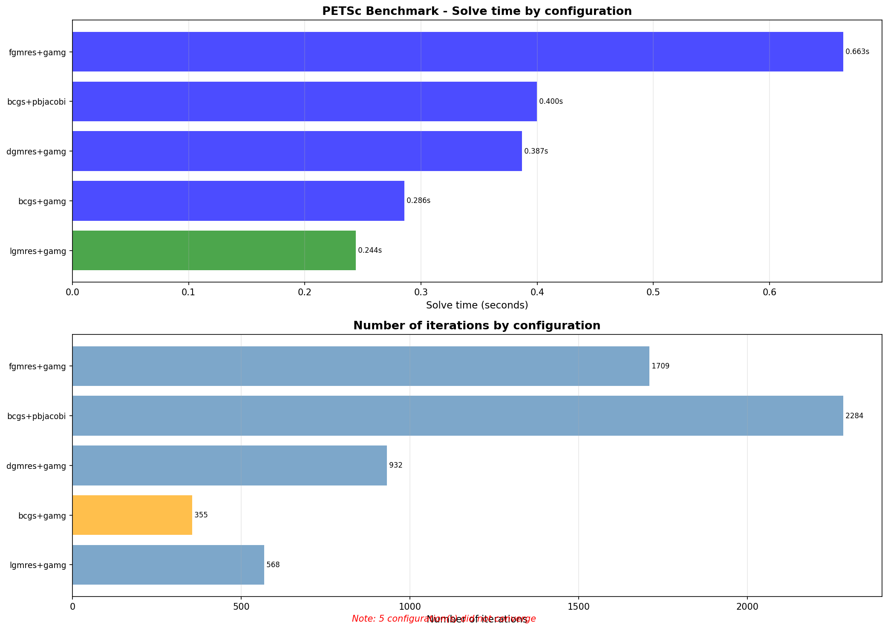

A small Python mini-application for testing PETSc solvers, built with CUDA, MPI, and petsc4py support.  
This README provides all the steps needed to set up the environment, install PETSc, prepare input data, and run the benchmark on the target HPC system.

---

## 1. Load required modules

With nvhpc compiler
```bash
module load nvhpc
module load cuda
module load cmake
module load hdf5/1.14.3-mpi
```

---

## 2. Create and activate the Python environment

```bash
/ssoft/spack/pinot-noir/kuma-h100/v1/spack/opt/spack/linux-rhel9-zen4/gcc-13.2.0/python-3.11.7-wpgsyqek7spdydbmic66srcfb3v7kzoi/bin/python3.11 -m venv myenv
source myenv/bin/activate

pip install numpy
pip install 'Cython>=3.0.0,<3.1.0'
```

---

## 3. Install PETSc (with CUDA + petsc4py)

Checkout PETSc version:

```bash
git checkout v3.21.4
```

Configure PETSc:

```bash
./configure \
  --with-clean \
  --with-cc=mpicc \
  --with-cxx=mpicxx \
  --with-fc=mpif90 \
  --with-cuda=1 \
  --with-cudac=nvcc \
  --with-cuda-arch=90 \
  --with-debugging=0 \
  --with-petsc4py=1 \
  --prefix=/scratch/peyberne/petsc-install-python
```

Build and install:

```bash
make
export CFLAGS=$(echo $CFLAGS | sed 's/-fwrapv//g')
make install
```

Verify petsc4py:

```bash
python3 -c "import petsc4py; print(petsc4py.__version__)"
```

---

## 4. Input files

All PETSc binary input files should be placed in the `data/` directory:

```
data/
 ├── mat.dat      # PETSc matrix
 ├── rhs.dat      # RHS vector
 ├── guess.dat    # optional initial guess
 └── sol.dat      # reference solution (from Fortran code)
```

---

## 5. Run the test

Submit the job with:

```bash
sbatch submission_script.sh
```

The script internally runs:

```bash
srun python3 benchmark_petsc.py \
    --mat data/mat.dat \
    --rhs data/rhs.dat \
    --guess data/guess.dat \
    --ref data/sol.dat \
    --gpu
```

---

## 6. Running the benchmark manually

### CPU only

```bash
python3 benchmark_petsc.py --mat data/mat.dat --rhs data/rhs.dat
```

### With initial guess

```bash
python3 benchmark_petsc.py --mat data/mat.dat --rhs data/rhs.dat --guess data/guess.dat
```

### With reference solution (L1 error comparison)

```bash
python3 benchmark_petsc.py --mat data/mat.dat --rhs data/rhs.dat --ref data/sol.dat
```

### GPU mode (CUDA Vec + AIJcuSPARSE Mat)

```bash
python3 benchmark_petsc.py \
    --mat data/mat.dat \
    --rhs data/rhs.dat \
    --guess data/guess.dat \
    --ref data/sol.dat \
    --gpu
```

GPU mode internally sets:

- `mat_type = aijcusparse`
- `vec_type = cuda`

---

## 7. Output

Benchmark plots and logs are stored in:

```
results/
 └── benchmark_results.png
```

The plot includes:

- solve time per configuration  
- iteration counts  
- convergence failures  
- **L1 error vs reference solution (sol.dat)**  

---

## Illustration

Below is an example of the plot produced by the miniapp:



---

## Notes

- Ensure that the PETSc installation prefix (`petsc-install-python`) matches the configure step.
- `petsc4py` must be installed **via PETSc’s configure**, not via `pip install petsc4py`.
- This miniapp works both on CPU and GPU.
