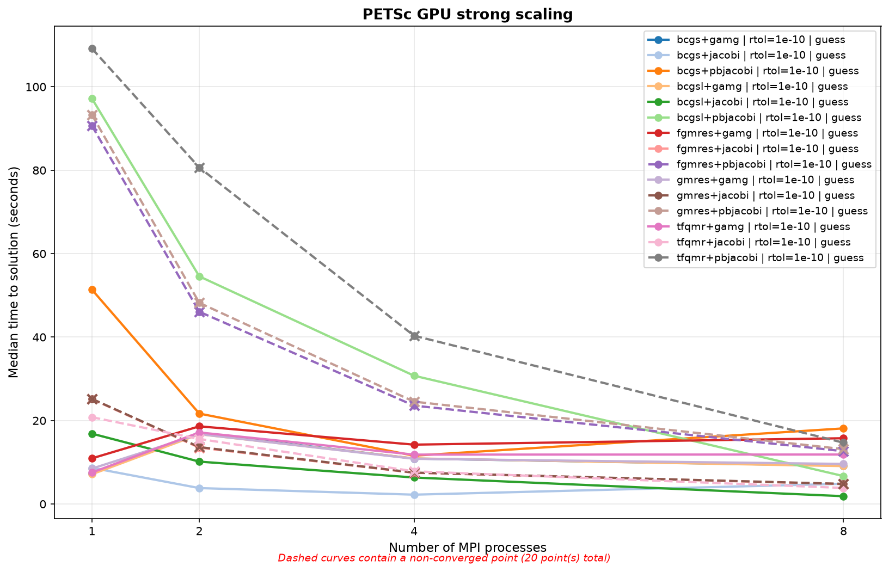

# petsc-python-miniapp

A small Python mini-application for testing PETSc solvers, built with CUDA, MPI, and petsc4py support.  
This README provides all the steps needed to set up the environment, install PETSc, prepare input data, and run the benchmark on the target HPC system.

---

## 1. Load required modules

With nvhpc compiler
```bash
module load nvhpc
module load cuda
module load cmake
module load hdf5/1.14.3-mpi
```

---

## 2. Create and activate the Python environment

```bash
/ssoft/spack/pinot-noir/kuma-h100/v1/spack/opt/spack/linux-rhel9-zen4/gcc-13.2.0/python-3.11.7-wpgsyqek7spdydbmic66srcfb3v7kzoi/bin/python3.11 -m venv myenv
source myenv/bin/activate

pip install numpy
pip install matplotlib
pip install 'Cython>=3.0.0,<3.1.0'
```

---

## 3. Install PETSc (with CUDA + petsc4py)

Checkout PETSc version:

```bash
git checkout v3.21.4
```

Configure PETSc:

```bash
./configure \
  --with-clean \
  --with-cc=mpicc \
  --with-cxx=mpicxx \
  --with-fc=mpif90 \
  --with-cuda=1 \
  --with-cudac=nvcc \
  --with-cuda-arch=90 \
  --with-debugging=0 \
  --with-petsc4py=1 \
  --prefix=/scratch/peyberne/petsc-install-python
```

Build and install:

```bash
make
export CFLAGS=$(echo $CFLAGS | sed 's/-fwrapv//g')
make install
```

Verify petsc4py:

```bash
python3 -c "import petsc4py; print(petsc4py.__version__)"
```

---

## Pitagora (Boost partition)

Pitagora provides an nvhpc PETSc module with CUDA support, so PETSc itself does
not need to be built locally.

### 1. Load PETSc and create the Python environment

```bash
module purge
module load nvhpc/25.11
module load petsc/3.22.0--hpcx-mpi--2.25.1--nvhpc--25.11-mumps

python3 -m venv myenv
source myenv/bin/activate
python -m pip install numpy matplotlib wheel setuptools "Cython==3.0.12"
```

Cython 3.0.12 is used because petsc4py 3.22.0 does not build with Cython 3.3.0.

### 2. Install petsc4py against the module PETSc

The Pitagora linker may report that `/usr/lib64/libatomic.so.1.2.0` is missing.
For the current user installation, a copy is available as
`~/libatomic.so.1.2.0`. Create an unversioned linker name and add the directory
to the build flags:

```bash
ln -sfn libatomic.so.1.2.0 "$HOME/libatomic.so"

export PETSC_ARCH=
export CFLAGS="-O3 -DNDEBUG"
export CXXFLAGS="-O3 -DNDEBUG"
export LDFLAGS="-L$HOME -Wl,-rpath,$HOME"

python -m pip install petsc4py==3.22.0 \
    --no-build-isolation \
    --no-cache-dir
```

### 3. Load the runtime environment

The repository contains the tested runtime setup:

```bash
source env_pitagora_python-petsc.sh
```

It loads nvhpc 25.11 and PETSc 3.22.0, activates `myenv`, and sets
`OPAL_PREFIX` for the HPC-X Open MPI installation.

Do not test CUDA-enabled petsc4py on a login node because `libcuda.so.1` is
available only on GPU compute nodes. Submit a smoke test instead:

```bash
sbatch --nodes=1 --ntasks=1 --cpus-per-task=4 --gpus-per-task=1 \
    --partition=boost_fua_dbg --time=00:05:00 \
    --wrap='source env_pitagora_python-petsc.sh; srun python -c "from petsc4py import PETSc; A=PETSc.Mat().createAIJ([8,8]); A.setType(PETSc.Mat.Type.SEQAIJCUSPARSE); A.setUp(); print(PETSc.Sys.getVersion(), A.getType())"'
```

The expected matrix type is `seqaijcusparse`.

### 4. Run on Boost

Set the data paths in `submission_script_pitagora.sh`, then submit the scaling
benchmark:

```bash
sbatch --export=ALL,MPI_COUNTS=1:2:4,REPETITIONS=3 \
    submission_script_pitagora.sh
```

Use `bcgsl` with `gamg` for the transferred coarse vorticity case. The
`bjacobi` and `ilu` configurations encounter zero pivots and return a NaN
residual before the first iteration.

---

## 4. Input files

All PETSc binary input files should be placed in the `data/` directory:

```
data/
 ├── mat.dat        # PETSc matrix
 ├── rhs.dat        # RHS vector
 ├── guess.dat      # optional initial guess
 ├── sol.dat        # reference solution (from Fortran code)
 └── options.json   # JSON file describing solver configurations
```

Example `options.json`:

```json
{
  "ksp_rtol": [1e-13],
  "pc_type": ["gamg", "pbjacobi"],
  "ksp_type": ["gmres", "bcgs"],
  "use_initial_guess": [true]
}
```

The code generates all combinations of these lists (Cartesian product).  
If `--config` is not provided, a built-in default set of options is used.

---

## 5. Run the test

Submit the job with:

```bash
sbatch submission_script.sh
```

By default, the submission benchmarks 1, 2, and 4 MPI processes with one GPU
per process and reports the median of three solves. The MPI counts and number
of repetitions can be changed through exported environment variables:

```bash
sbatch --export=ALL,MPI_COUNTS=1:2:4,REPETITIONS=3 submission_script.sh
```

For each solver configuration, the first repetition creates the GAMG
preconditioner and includes its setup cost. Later repetitions reuse the same
KSP and preconditioner, matching SOLEDGE3x's steady-state solve behavior. The
JSON output records the setup-inclusive time as `first_solve_time`, all samples
as `time_samples`, and subsequent samples as `reuse_time_samples`. The reported
`time` and scaling plots use the median of the reused-preconditioner samples
when at least two repetitions are requested.

For a multi-node run, request enough nodes/tasks and include larger MPI counts.
Kuma has four H100 GPUs per node, for example:

```bash
sbatch --nodes=2 --ntasks=8 \
  --export=ALL,MPI_COUNTS=1:2:4:8,REPETITIONS=3 submission_script.sh
```

Use colons between MPI counts when passing `MPI_COUNTS` through
`sbatch --export`; Slurm uses commas to separate exported variables.

The script internally runs something like:

```bash
srun python3 benchmark_petsc.py \
    --mat data/mat.dat \
    --rhs data/rhs.dat \
    --guess data/guess.dat \
    --ref data/sol.dat \
    --config data/options.json \
    --gpu
```

---

## 6. Running the benchmark manually

### CPU only

```bash
python3 benchmark_petsc.py --mat data/mat.dat --rhs data/rhs.dat
```

### With initial guess

```bash
python3 benchmark_petsc.py --mat data/mat.dat --rhs data/rhs.dat --guess data/guess.dat
```

### With reference solution (L1 error comparison)

```bash
python3 benchmark_petsc.py --mat data/mat.dat --rhs data/rhs.dat --ref data/sol.dat
```

### With JSON config file

```bash
python3 benchmark_petsc.py \
    --mat data/mat.dat \
    --rhs data/rhs.dat \
    --guess data/guess.dat \
    --ref data/sol.dat \
    --config data/options.json
```

### GPU mode (CUDA Vec + AIJcuSPARSE Mat)

```bash
python3 benchmark_petsc.py \
    --mat data/mat.dat \
    --rhs data/rhs.dat \
    --guess data/guess.dat \
    --ref data/sol.dat \
    --config data/options.json \
    --gpu
```

---

## 7. Output

Benchmark plots and logs are stored in:

```
results/
 └── benchmark_results.png
```

The plot shows the median time to solution against the number of MPI processes,
with one curve for each KSP solver and preconditioner combination. Raw timing
samples and solver results are stored in `results/scaling_<job>_<mpi>.json`.

---

## Illustration



---

## Notes

- Ensure that the PETSc installation prefix (`petsc-install-python`) matches the configure step.
- On Kuma, petsc4py is installed through PETSc's configure step. On Pitagora,
  install the matching petsc4py version with pip against the loaded PETSc
  module as described above.
- This miniapp works both on CPU and GPU.
